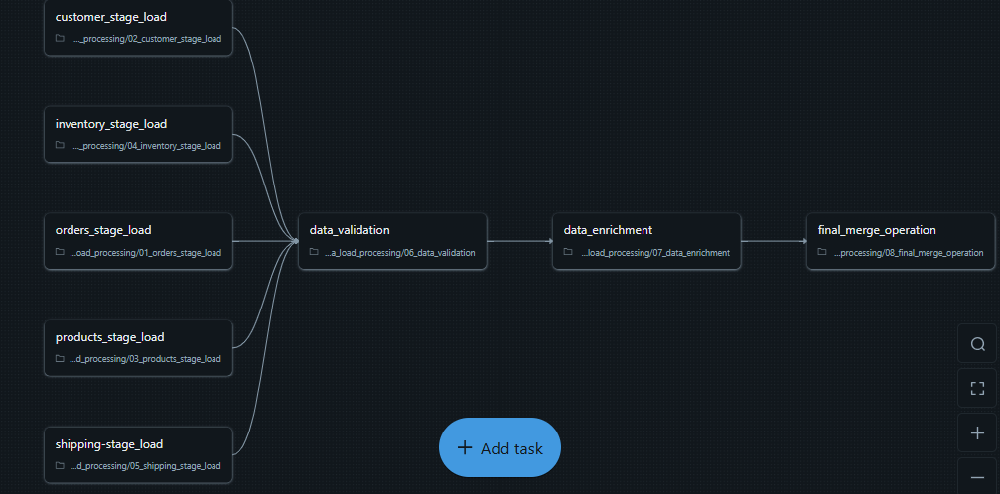

# E-commerce Event-Driven Data Pipeline

Built an event-driven e-commerce ETL pipeline on Databricks using PySpark and Delta Lake, featuring automated ingestion, data validation, and SCD Type 2 implementation.

---

## Architecture Components

### 1. Source Layer – Amazon S3 (Databricks External Volumes)
Raw e-commerce data files (orders, customers, products, inventory, and shipping) are stored in Amazon S3 and accessed securely via Databricks External Volumes to enable scalable and governed ingestion.

### 2. Event Trigger Layer
JSON trigger files initiate batch processing and control pipeline execution through Databricks Workflows.

### 3. Ingestion Layer
PySpark-based ingestion is implemented using dataset-specific notebooks, where each notebook processes a single dataset (orders, customers, products, inventory, shipping). Raw files are read into Spark DataFrames from Databricks External Volumes, followed by schema validation.

### 4. Staging Layer (Delta Lake)
Validated Spark DataFrames are standardized and written to staging Delta tables using overwrite mode, ensuring each run maintains the latest trusted snapshot of source data.

### 5. Data Validation Layer
Performs cross-reference validation and business rule checks on staging Delta tables to ensure referential integrity and data consistency across datasets.

### 6. SCD Type 2 Layer
Implements Slowly Changing Dimension (Type 2) logic to maintain historical dimension records by tracking effective start and end dates, managing updates through Delta Lake MERGE operations, and using an `is_current` flag to identify active records.

---

### ETL Pipeline Workflow

---

## Technology Used
- Databricks (Notebooks, Workflows, External Volumes)
- Apache Spark (PySpark)
- Delta Lake (ACID tables, MERGE operations, SCD Type 2)
- Amazon S3 (External Storage via Databricks External Volumes)
- GitHub

---

## 📁 Dataset Descriptions

### Orders Dataset  
Transactional order-level data including order details, pricing, quantity, and status.  
🔗 https://github.com/Mahesh-moco/E-commerce-Event-Driven-Data-Pipeline/blob/main/data/2025_01_15/orders_2025_01_15.csv

### Customers Dataset  
Customer master data containing demographic, contact, and segmentation information.  
🔗 https://github.com/Mahesh-moco/E-commerce-Event-Driven-Data-Pipeline/blob/main/data/2025_01_15/customers_2025_01_15.csv

### Products Dataset  
Product catalog data including product attributes, category, brand, and pricing.  
🔗 https://github.com/Mahesh-moco/E-commerce-Event-Driven-Data-Pipeline/blob/main/data/2025_01_15/products_2025_01_15.csv

### Inventory Dataset  
Inventory stock levels and warehouse availability information.  
🔗 https://github.com/Mahesh-moco/E-commerce-Event-Driven-Data-Pipeline/blob/main/data/2025_01_15/inventory_2025_01_15.csv

### Shipping Dataset  
Shipping and delivery tracking data including shipment status and logistics details.  
🔗 https://github.com/Mahesh-moco/E-commerce-Event-Driven-Data-Pipeline/blob/main/data/2025_01_15/shipping_2025_01_15.csv

---
### Ingestion Notebooks

PySpark-based ingestion is implemented using dataset-specific notebooks, where each notebook processes a single dataset:

- **Orders** – Processes orders data from source files and loads it into the staging table  
  🔗 [Notebook Link](https://github.com/Mahesh-moco/E-commerce-Event-Driven-Data-Pipeline/blob/main/ETL%20NOTEBOOK/01_orders_stage_load.ipynb)

- **Customers** – Processes customer data from source files and loads it into the staging table  
  🔗 [Notebook Link](https://github.com/Mahesh-moco/E-commerce-Event-Driven-Data-Pipeline/blob/main/ETL%20NOTEBOOK/02_customer_stage_load.ipynb)

- **Products** – Processes product data from source files and loads it into the staging table  
  🔗 [Notebook Link](https://github.com/Mahesh-moco/E-commerce-Event-Driven-Data-Pipeline/blob/main/ETL%20NOTEBOOK/03_products_stage_load.ipynb)

- **Inventory** – Processes inventory data from source files and loads it into the staging table  
  🔗 [Notebook Link](https://github.com/Mahesh-moco/E-commerce-Event-Driven-Data-Pipeline/blob/main/ETL%20NOTEBOOK/04_inventory_stage_load.ipynb)

- **Shipping** – Processes shipping data from source files and loads it into the staging table  
  🔗 [Notebook Link](https://github.com/Mahesh-moco/E-commerce-Event-Driven-Data-Pipeline/blob/main/ETL%20NOTEBOOK/05_shipping_stage_load.ipynb)

- **Data Validation** – Performs comprehensive data validation across all staging tables and applies business rules  
  🔗 [Notebook Link](https://github.com/Mahesh-moco/E-commerce-Event-Driven-Data-Pipeline/blob/main/ETL%20NOTEBOOK/06_data_validation.ipynb)

- **Data Enrichment** – Enriches validated data with additional business metrics and prepares it for analytics  
  🔗 [Notebook Link](https://github.com/Mahesh-moco/E-commerce-Event-Driven-Data-Pipeline/blob/main/ETL%20NOTEBOOK/07_data_enrichment.ipynb)

- **Final Merge Operation** – Consolidates all processed data into target tables with SCD2 (Slowly Changing Dimension) logic  
  🔗 [Notebook Link](https://github.com/Mahesh-moco/E-commerce-Event-Driven-Data-Pipeline/blob/main/ETL%20NOTEBOOK/08_final_merge_operation.ipynb)
---
